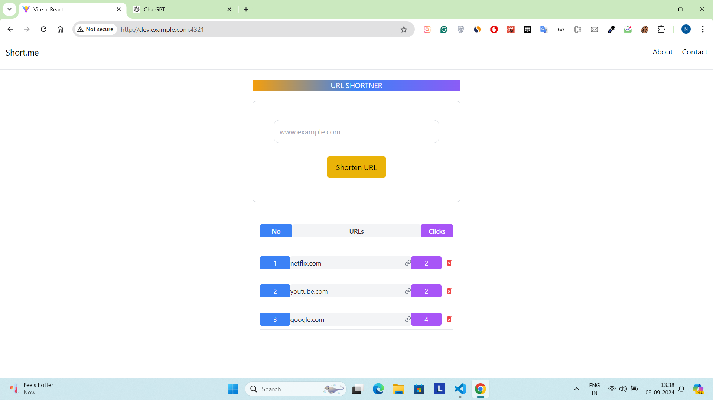
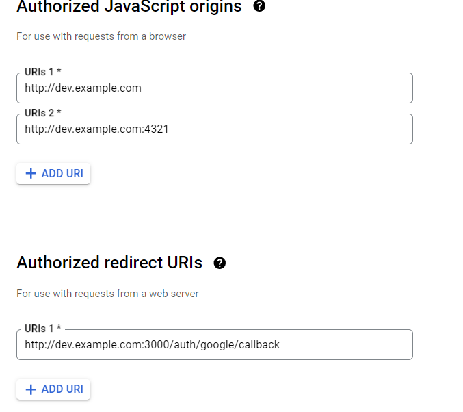

# URL Shortener

A simple URL shortener web application that allows users to shorten long URLs and track the number of clicks on each shortened link.

## Features

- **URL Shortening**: Convert long URLs into short, shareable links.
- **Click Tracking**: Monitor how many times each shortened URL has been clicked.
- **Responsive Design**: Works well on both mobile and desktop devices.
- **User Authentication**: Google authentication for managing user URLs.

## Technologies Used

- **Frontend**: React.js, Tailwind CSS, Vite
- **Backend**: Node.js, Express.js, MongoDB (or any other database you use)
- **Authentication**: Google OAuth with Passport.js
- **Deployment**: [Your chosen deployment platform]

## Project Image



## Important changes

- **In PC**: We need to chnage the hosts file located at C:\Windows\System32\drivers\etc\hosts.
- **to**: 127.0.0.1 dev.example.com ( with adminstration permission)

## From Google Auth credentials

## Installation

### Clone the Repository

```bash
git clone https://github.com/NinadxBaruah/url-shortener.git
cd url-shortener
Navigate to the Backend Directory

bash
Copy code
cd backend
Create a .env File

Add the following environment variables to a .env file in the backend directory:

plaintext
Copy code
MONGO_DB_CONNECTION_URL=your-mongodb-connection-url
JWT_SECRET=your-jwt-secret
CLIENT_ID=your-google-client-id
CLIENT_SECRET=your-google-client-secret
SITE_URL=your-site-url
Install Backend Dependencies

Install the necessary packages:

bash

npm install express passport dotenv cors body-parser cookie-parser
Start the Backend Server

bash

npm start
Frontend Setup
Navigate to the Frontend Directory

bash

cd frontend
Create a .env File

Add the following environment variable to a .env file in the frontend directory:

plaintext

VITE_API_URL=your-api-url
Install Frontend Dependencies

Install the necessary packages:

bash

npm install vite react react-dom tailwindcss
Start the Frontend Development Server

bash

npm run dev
```
